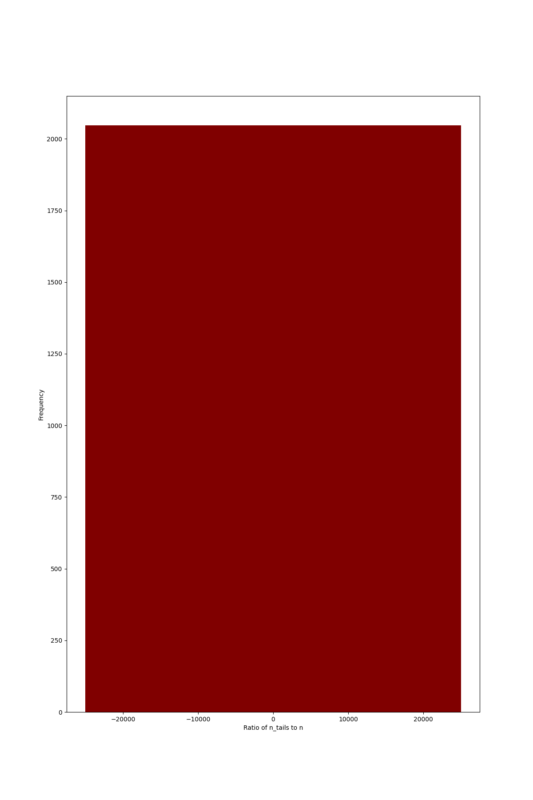

# Coin Toss Simulation

This Python script simulates coin tosses and analyzes the distribution of the ratio of the number of tails to the total number of coin tosses for a given number of coins.

## Coin Toss Simulation Function

The `coinToss` function performs a single round of coin tosses. It takes two arguments: `n` (the number of coin tosses) and `prob_tail` (the probability of getting a tail, default value is 0.5). The function simulates `n` coin tosses and returns the number of tails obtained, the total number of tosses, and the record of the outcomes (heads or tails) in a list.

## Simulation and Analysis

The `simulate` function runs the coin toss simulation for a specified number of rounds (`n_rounds`). For each round, it calls the `coinToss` function and calculates the ratio of the number of tails to the total number of tosses. The function stores the results in a dictionary, where the keys represent the ratio, and the values represent the frequency of occurrence of that ratio.

## Drawing the Graphs

The `draw_curve` function takes the results dictionary, the number of coins (`n_coins`), and the probability of getting a tail (`p_tail`) as arguments. It visualizes the distribution of the ratios using a bar graph. The x-axis of the graph represents the ratio of tails to the total number of tosses, and the y-axis represents the frequency of occurrence of each ratio. The function saves the graph as a PNG image named `output_{p_tail}.png`.

## Example

The provided code runs two simulations:

1. A simulation with 500,000 rounds of 500 coin tosses each, assuming a probability of getting a tail (`prob_tail`) as 0.7. The results of this simulation are used to draw the first graph.

2. A simulation with 500,000 rounds of 500 coin tosses each, assuming the default probability of getting a tail (0.5). The results of this simulation are used to draw the second graph.

Below are the graphs depicting the distribution of the ratios for both simulations:

<!-- {width=100} -->

The graphs visually represent how frequently each ratio of tails to the total number of tosses occurred during the simulations. The x-axis ranges from 0 to 1, representing the possible ratios, and the y-axis represents the frequency of each ratio.
